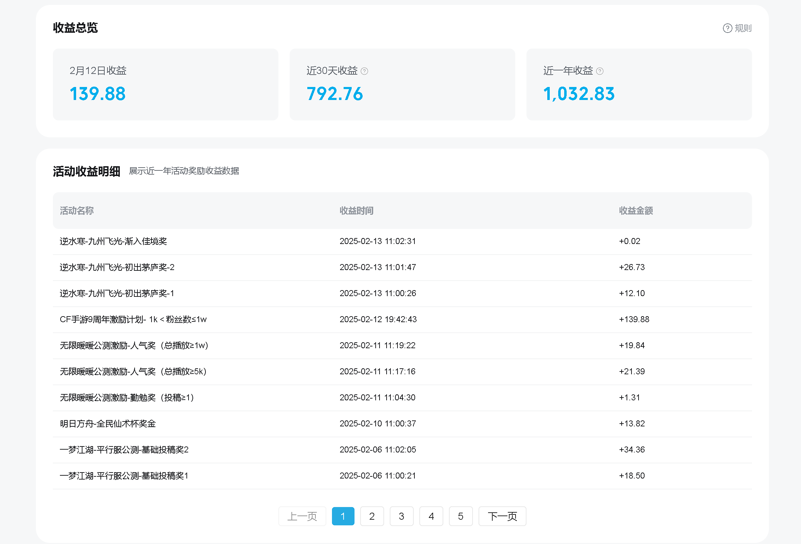
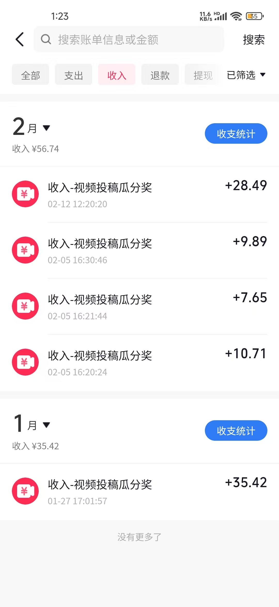
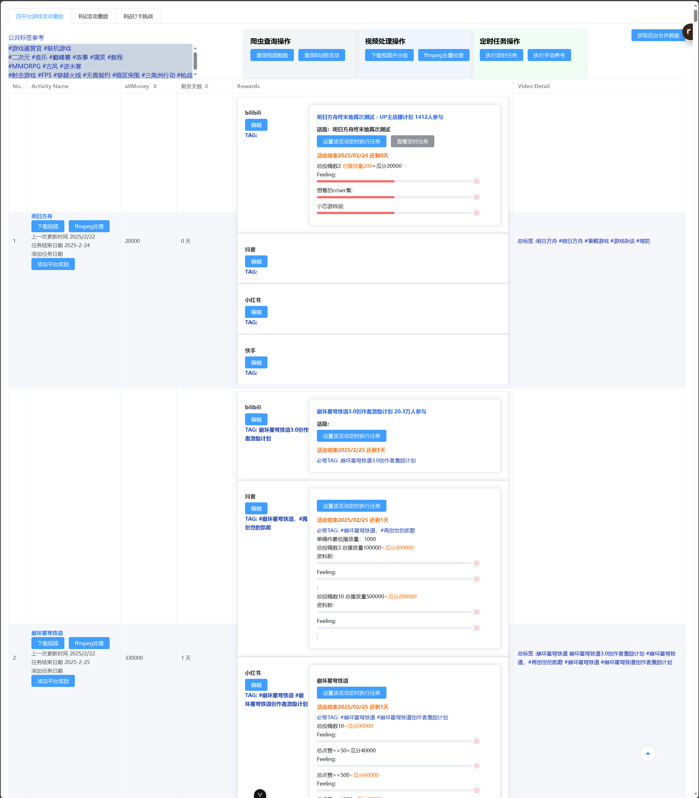
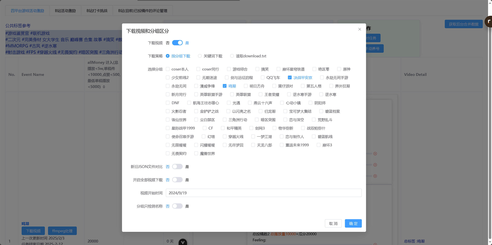
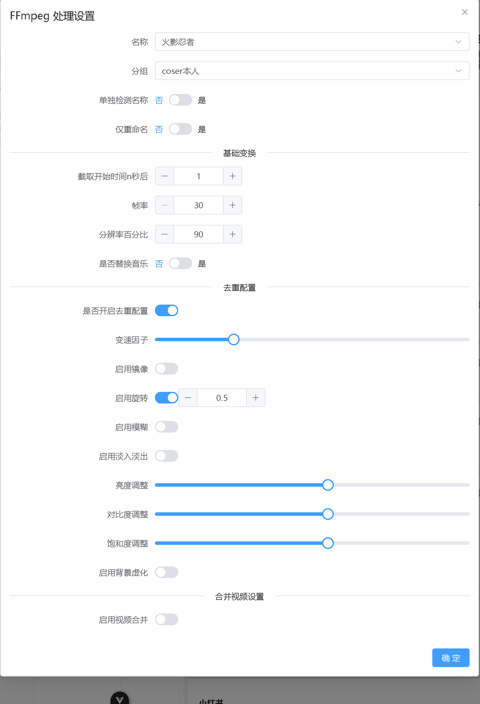

# 介绍

这是一个集合下载，去重，并自动上传视频到自媒体平台爆米的综合管理后台，暂时不依赖数据库。**目前处于积极更新中~**

该项目原先是自己探索自媒体挣米，去仿 B 站 （虎扑评分排行榜）这种定位类型的自媒体账号，写的一个自动制作相应风格视频的网页工具，后续不断扩大，想写成自动去完成多平台游戏任务的综合管理后台。虽然已经能跑通了盈利点,但是由于刚开始未往这个方向思考，整体写的很乱。目前想优化的点很多，但是自己现在正在寻找工作。公开后期望后续能寻找到想探索自媒体赚米，（特别是游戏自媒体方向）的开发者，一起完善该项目。

挣米逻辑
（发视频做相关任务，达标后 1-2 月后发放收益，账号不限粉丝量，该工具能以多号的方式扩大收益，目前也往这个方向开发设计）

小红书/快手 刚开始跑,我自己的号之前不怎么玩这两个平台,待测收益。

# 依赖

在开始之前，请确保你已经安装了以下软件和依赖项目仓库

- Python 3.12
- Node.js
- [ffmpeg](https://ffmpeg.org/) 视频去重处理
- [TikTokDownloader](https://github.com/SilverComet7/TikTokDownloader) 筛选视频
- [social-auto-upload](https://github.com/SilverComet7/social-auto-upload) 多平台定时上传
- [Crawler](https://github.com/SilverComet7/Crawler) 获取数据

## ✨ 核心功能

- **跨平台管理**：支持抖音/B 站/小红书等主流平台自动化运营
- **自定义视频去重**：基于 FFmpeg 的视频二次创作
- **任务自动化**：
  - 定时视频发布
  - 活动奖励追踪
  - 数据看板分析
- **轻量级架构**：无数据库依赖的本地化方案
- **多账号矩阵**：支持批量账号的协同运营管理

## 🚀 项目优势

- **零粉丝启动**：专为游戏厂商激励计划设计，新号即可参与

- 定时养号（B 站），快手/小红书/抖音 目前采用其它方式
- 筛选视频并下载 （抖音）
  - 关键词下载
  - 按分组下载
  - 读取特定 download.txt 文件路径下载
- 自定义控制视频去重参数
- 定时上传视频
- 视频数据聚合

## 🌱 未来计划

- [ ] 接入AI大模型辅助修改标题为爆款标题
