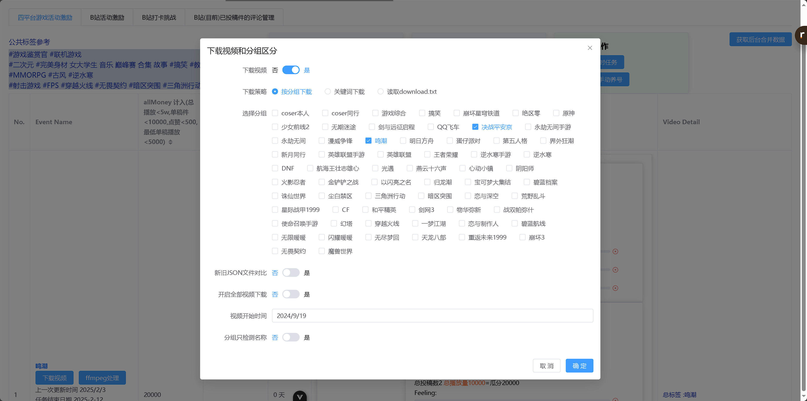

# 自媒体自动爆米工具

这是一个用于下载视频，去重后，并自动上传自媒体平台爆米的综合管理后台，不依赖数据库。

# 支持平台

- 抖音
- B 站
- 快手
- 小红书

# 依赖

在开始之前，请确保你已经安装了以下软件或依赖仓库

- Python 3.12
- Node.js
- [ffmpeg](https://ffmpeg.org/) 视频去重处理
- [TikTokDownloader](https://github.com/SilverComet7/TikTokDownloader) 筛选视频
- [social-auto-upload](https://github.com/SilverComet7/social-auto-upload) 多平台定时上传
- [Crawler](https://github.com/SilverComet7/Crawler) 获取数据

# 功能

- 筛选视频并下载 （抖音|小红书|快手）
  - 关键词下载
  - 按分组下载
  - 读取特定 download.txt 文件路径下载
- 控制去重选项
- 定时上传视频
- 视频数据聚合查看

