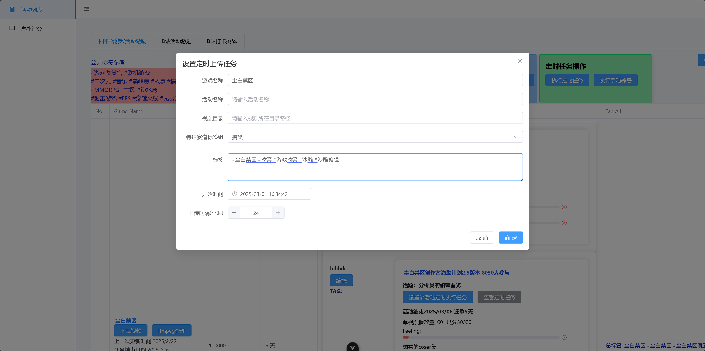

# 介绍

这是一个集合自媒体养号，下载，去重，自动上传视频，查询视频数据等多功能综合管理后台，暂时不依赖数据库。期望最终能打造一个自媒体爆米综合管理后台

> **目前处于积极更新中~**

该项目原先是自己探索自媒体挣米，去仿 **B 站 （虎扑评分排行榜）**这种类型定位的自媒体账号，写的一个**自动制作**相应风格视频的网页工具. 后续不断扩大，想写成自动去完成多平台游戏任务的综合管理后台。虽已经能跑通了盈利点，不过由于刚开始未往多账号多平台这个方向思考与设计，整体代码结构很乱，还有待优化的点很多。由于作者现在正在**寻找新工作**，所以将仓库公开后，期望后续能寻找到也想探索自媒体赚米，（特别是游戏自媒体方向）的开发者，一起去完善（**优化详见 TODO 文件**）该项目。

## 逻辑

（平台发放推广商单任务，接受任务后发视频做相关任务，达到设定的指标后， 1-2 月或 1-2 个版本后会发放收益，部分任务不要求账号粉丝量。以多号的方式扩大收益，目前也往这个方向开发设计）\*\*\*\*


**快手平台**刚开始跑,我自己的号之前不怎么玩这个平台,待测收益。

# 依赖

在开始之前，请确保你已经安装了以下软件和依赖项目仓库

- Python 3.12
- Node.js
- [TikTokDownloader](https://github.com/SilverComet7/TikTokDownloader) 筛选采集视频
- [ffmpeg](https://ffmpeg.org/) 视频去重处理
- [social-auto-upload](https://github.com/SilverComet7/social-auto-upload) 多平台定时上传
- [Crawler](https://github.com/SilverComet7/Crawler) 获取视频数据

## 安装步骤

1. 克隆项目到本地：

```bash
git clone https://github.com/SilverComet7/social-media-auto-make-money
cd social-media-auto-make-money
git clone https://github.com/SilverComet7/TikTokDownloader
git clone https://github.com/SilverComet7/Crawler
git clone https://github.com/SilverComet7/social-auto-upload
```

2. 安装项目依赖：

```bash
npm run install
```

其它仓库的依赖请参考各个仓库的 README.md 文件。

## 启动项目

### 开发环境

运行以下命令启动开发环境：

```bash
npm run dev_start
```

这将同时启动前端和后端服务。

# ✨ 核心功能

- **跨平台管理**：支持抖音/B 站/小红书等主流平台
- **自定义视频去重**：基于 FFmpeg 的视频二次创作
- **任务自动化**：
  - 定时视频发布
  - 活动奖励追踪
  - 数据看板分析
- **轻量级架构**：无数据库依赖的本地化方案
- **多账号矩阵**：支持批量账号的协同运营管理

# 🚀 项目优势

- **零粉丝启动**：专为游戏厂商激励计划设计，新号即可参与




# 🌱 已实现功能和未来计划

- [x] 定时养号（B 站）， 目前其它三个平台（快手/小红书/抖音）采用其它方式
- 筛选视频并下载 （抖音）
  - [x] 按分组下载
  - 关键词下载
  - 读取特定 download.txt 文件路径下载
- [x] 自定义控制视频去重参数
- [x] 设置定时任务上传视频
- [x] 视频数据聚合
- [ ] 查找对标同类型账号
- [ ] 每日多平台自动养号
- [ ] 辅助内容创作：视频采集 / 分镜混剪 / 视频去重 / 文案生成 / 接入 AI 大模型辅助修改标题为爆款标题
- [ ] 批量分发
- [ ] GUI 桌面化
